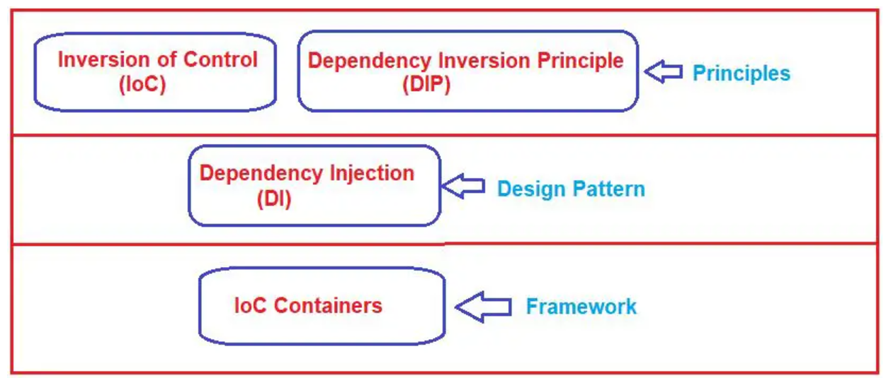

# Design Pattern vs Design Principle

## Design Principle

- **Design Principle** is a general solution to a common problem in software design.
- It is a set of high level guidelines that helps in designing software that is easy to maintain and extend.
- It does not provide any implementation details or is bound to a specific language.
- example: SOLID principles, DRY principle, KISS principle, YAGNI principle, etc.

## Design Pattern

- **Design Pattern** is a specific reusable solution to a common problem in software design.
- They are basically used to solve the problems of object generation and integration.

